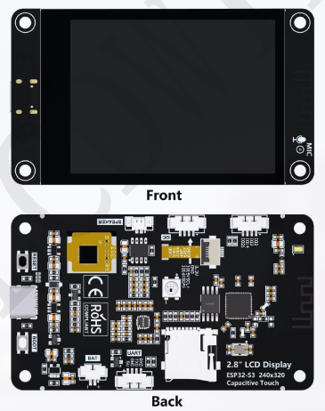

# Hosyond ESP32-S3 2.8-inch Display

I'm learning how to configure and interface the Hosyond ESP32-S3 2.8" Display board.

This repository contains my configuration notes and code experiments for the Hosyond ESP32-S3 2.8-inch development board. The board pairs an ESP32-S3 microcontroller (16 MB Flash, 8 MB OPI PSRAM) with an integrated 240x320 ILI9341V TFT display, capacitive touch, USB-C, and onboard audio peripherals.

## Board Overview

The Hosyond ESP32-S3 2.8-inch development board (model ES3C28P) integrates an ESP32-S3 MCU (16 MB Flash, 8 MB OPI PSRAM) with an onboard 240x320 ILI9341V LCD panel, capacitive touch (I2C), native USB-C, and audio amplifier peripherals.

## Arduino IDE Setup

In Arduino IDE, select the target board as **ESP32S3 Dev Module** under the Tools menu. Ensure **USB CDC On Boot** is set to **Enabled** so `Serial` communication functions over the native USB-C port, set **PSRAM** to **OPI PSRAM**, and set **Flash Size** to **16MB (128Mb)**.

## Pinout Reference

Verified onboard GPIO mapping based on the ES3C28P specification:

| Signal | ESP32-S3 GPIO | Function |
| :--- | :--- | :--- |
| `TFT_CS` | `GPIO 10` | Display Chip Select (active LOW) |
| `TFT_DC` | `GPIO 46` | Display Command / Data selection |
| `TFT_SCLK` | `GPIO 12` | Display SPI Clock |
| `TFT_MOSI` | `GPIO 11` | Display SPI Data In (Write) |
| `TFT_MISO` | `GPIO 13` | Display SPI Data Out (Read) |
| `TFT_RST` | `-1` | Reset (tied to system EN) |
| `TFT_BL` | `GPIO 45` | Backlight control (active HIGH) |
| `TOUCH_SDA` | `GPIO 16` | Capacitive Touch I2C SDA |
| `TOUCH_SCL` | `GPIO 15` | Capacitive Touch I2C SCL |
| `TOUCH_RST` | `GPIO 18` | Capacitive Touch Reset |
| `TOUCH_INT` | `GPIO 17` | Capacitive Touch Interrupt |
| `RGB_LED` | `GPIO 42` | Onboard RGB LED |
| `BAT_ADC` | `GPIO 9` | Battery Voltage ADC |
| `AMP_EN` | `GPIO 1` | Audio Amplifier Enable (active LOW) |

Available expansion pins for external modules: `GPIO 2`, `GPIO 3`, `GPIO 14`, and `GPIO 21`.

## Notes

- Drive the backlight pin (`GPIO 45`) HIGH during initialization to turn on the screen.
- If Serial Monitor output is missing, verify that USB CDC On Boot is enabled in Tools.
- Ensure PSRAM mode is set to OPI PSRAM to avoid crash loops on startup.
